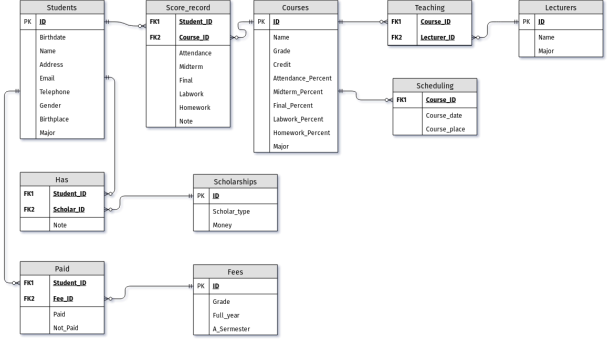

---
title:
- USTH Student Information Management
subtitle:
- Basic Database Final Project
author:
- Group 6
date: \today{}
institute:
- University of Science and Technology of Hanoi
- ICT Department
theme:
- CambridgeUS
---
# Problem and Idea

## USTH student problem
- Hard to access the student information from student side

- Too many place to access information but lack of place to navigate

## Idea for solving 
- Navigate all basic information to 1 place

- Open access for all student can see information

- Easy to synchronize some neccessary information

## What students can see ?
- Students can access to all marks information from year 1 to year 3

- Students can see all course information including timetable, lecturers's information, ....

- Students can see all tuition fees that they have paid or have not fully paid yet and also their scholarships information

## Student information schema

## Diagram table 

## Constraint
- ID: type varchar(10)

- Money: type varchar(20)

- Date: type datetime

- Points: type double

- student's information: type varchar()

