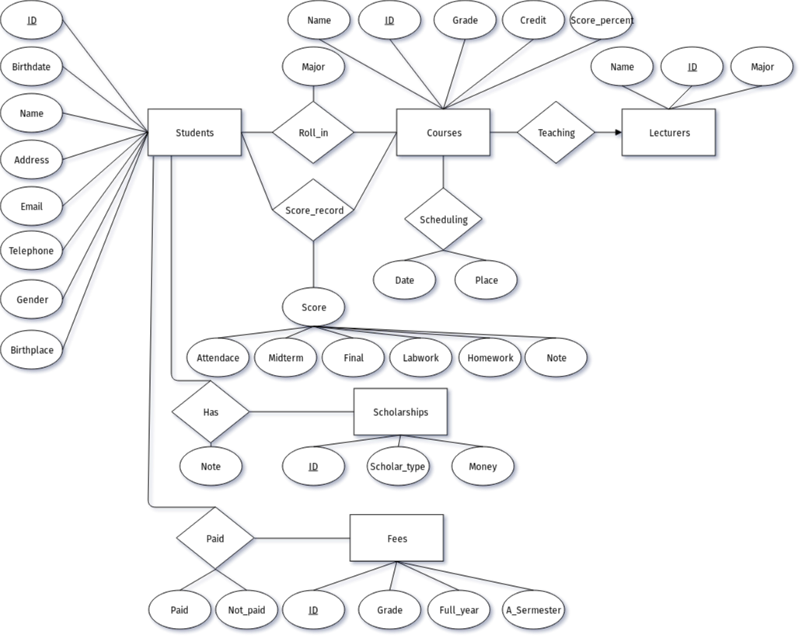
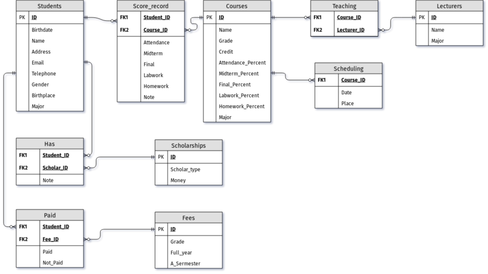

---
title:
- USTH Student Information Management
subtitle:
- Basic Database Project Report
author:
- Group 6
date: \today{}
institute:
- University of Science and Technology of Hanoi
- ICT Department
documentclass: report
---

# 1. Overview

## 1.1) Introduction to DBMS
Database is a collection of related data and data is a collection of facts and figures that can be processed to produce information.

Mostly data represents recordable facts. Data aids in producing information, which is based on facts. For example, if we have data about marks obtained by all students, we can then conclude about toppers and average marks.

A database management system stores data in such a way that it becomes easier to retrieve, manipulate, and produce information.

## 1.2) Project Scenario
A student management system (also known as a student information system or SIS) helps a school manage data, communications, and scheduling.

A school system generates and uses a large amount of data. This data must be communicated appropriately to students, faculty, and parents. A student management system helps schools to store, manage, and distribute this information. And DBMS is used as the efficient tool for storing and handling this data.

Some student management systems are designed to serve all of a school’s data management needs. Other student management systems are specialized. These specialized solutions target specific needs, such as school applications or student behavior tracking.

# 2. Analysis & Requirement

## 2.1) Purpose and goal
In our view, the student management is specialized solution for the lack of one space navigating student information (marks, tuition, courses, ..) that the student can access of USTH.

Our goal is design the simple system that easily update and manipulate, but still keeping enought information for needed of student. And, it must be access by everyone working on USTH. 

## 2.2) Design philosorphy
1. System is simple: system need to simple enought for updating and manipulate. It also needed if want to avoid error and conflig when system expand for more information. 

2. All student need to be categorized major in first year: This is important for design marks system which all students in same major will roll-in same courses then has same score_record following course id.

3. Students is managed by gen: Instead of managing all usth students in 1 database which leading to complex and not simple (conflig 1). Divice and manage database following each gen. And keep tracking until that gen graduate.

4. Managing student & course following major: each gen has many major, and each major is 1 class (as define in 2). Then for managing students information of specific class, we manage it following major.

## 2.3) Database Structure
Following philosorphy, we design the simple framwork for storing data of a USTH student gen that will keep tracking and update continously until that gen graduate.

The main tables (entities set) are Students, Courses, Lecturers, Scholarships, Fees. Following is 5 relationship tables are Score_record, Teaching, Scheduling, Has, Paid which represent the relation between main tables and containing forgein key to connect to its main table.

| Table | Description |
| ----- | ----------- |
| Students | Contain detail information about students |
| Courses | Contain detail information about courses |
| Lectures | Specify name and major of lecturers |
| Scholarship | Specify type and money of scholarship |
| Fees | Contain detail information about tuition |
| Score_record | Contain all marks of coures following students ID (FK: Student_ID, Course_ID) |
| Teaching | Specify the main lecturer for each course (FK: Course_ID, Lecturer_ID) |
| Scheduling | Keep tracking information about place and time of courses (FK: Course_ID) |
| Has | Specify students who has scholarship and type scholarship (FK: Student_ID, Scholar_ID) |
| Paid | Keep tracking students tuition following each students (FK: Student_ID, Fee_ID) |

## 2.4) Requirement
Following purpose of student demand on 1 space synthetic all information for marks, courses, tuition and scholarship.

Our database can cover some possible requirements (design system allowing expand more for future):
- Find out score of specific course in 1 gen
- Find out information of student depend on his or her first name
- Find out student scores of all course following his or her id
- Find out all scores of all students in all courses that has final score greater than critical score

# 3. Project designing detail

## 3.1) ER Diagram
This project is build in mySQL platform, which require many relationship between many table and leading to many redundancy, complexing unecessary key and error type if not careful. 

For make sure system stable, causual and avoid conflig, We define 1 philosophy for system as mention in (2.3).

Then we sketch out the main table contain information needed such as Students table, Courses table, v.v. . In each main table, more detail attribute was added. After that, we design realtionship between each main table for making system more reasonable. Example, for connecting students and courses tables, we have 2 relationship is roll-in ( depend on attribute major of student and course) and score_record ( which is relation table represent scores of student on each course ).

Finally, after design many tables and relationship on draf, our process leading to ER daiagram as below  


  
## 3.2) Diagram table

### 3.2.1) Constraint
Before deploying system from ER diagram to mySQL, we must define rule for data that will be added to tables (constraints). This will help clarify the identify of the table

```
"Constraints are used to specify rules for the data in a table."
``` 

This is all constraints deploy on table (`Appendix A`):

- `NOT NUL` - constraint allows to specify that a column can not contain any null value.
- `DEFAULT` - if no value is supplied to a column, then the column gets the value set as default.
- `PRIMARY KEY` -  constraint for a table enforces the table to accept unique data for a specific column and creates a unique index for accessing the table faster. 
- `FOREIGN KEY` - iquely identifies a row/record in another table

### 3.2.2) Binary relationship
After specify constraints for table, we design binary relationship for tables as below  



# Appendix A
1. Table Students
- `ID` varchar(10) NOT NULL,
- `last_name` varchar(50) DEFAULT NULL,
- `first_name` varchar(50) DEFAULT NULL,
- `birthdate` date DEFAULT NULL,
- `gender` enum('M','F') DEFAULT NULL,
- `birth_place` varchar(100) DEFAULT NULL,
- `address` varchar(100) DEFAULT NULL,
- `email` varchar(50) DEFAULT NULL,
- `telephone` int(15) DEFAULT NULL,
- `major` varchar(100) DEFAULT NULL,
- PRIMARY KEY (`ID`)

2. Table Courses
- `ID` varchar(10) NOT NULL,
- `course_name` varchar(100) DEFAULT NULL,
- `credits` int(5) DEFAULT NULL,
- `major` varchar(100) DEFAULT NULL,
- `grade` int(5) DEFAULT NULL,
- `attendance_percent` double DEFAULT NULL,
- `homework_percent` double DEFAULT NULL,
- `labwork_percent` double DEFAULT NULL,
- `midterm_percent` double DEFAULT NULL,
- `final_percent` double DEFAULT NULL,
- PRIMARY KEY (`ID`)

3. Table Lecturers
- `ID` varchar(10) NOT NULL,
- `First_name` varchar(50) DEFAULT NULL,
- `Last_name` varchar(50) DEFAULT NULL,
- `major` varchar(100) DEFAULT NULL,
- PRIMARY KEY (`ID`)

4. Table Scholarships
- `ID` varchar(10) NOT NULL,
- `Scholar_type` varchar(3) DEFAULT NULL,
- `Money` varchar(20) DEFAULT NULL,
- PRIMARY KEY (`ID`)

5. Table Fees
- `ID` varchar(10) NOT NULL,
- `Grade` varchar(10) DEFAULT NULL,
- `Full_year` varchar(20) DEFAULT NULL,
- `A_semester` varchar(20) DEFAULT NULL,
- PRIMARY KEY (`ID`)

6. Table Score_record
- `course_id` varchar(10) NOT NULL,
- `student_id` varchar(10) NOT NULL,
- `attendance` double DEFAULT NULL,
- `homework` double DEFAULT NULL,
- `labwork` double DEFAULT NULL,
- `midterm` double DEFAULT NULL,
- `final` double DEFAULT NULL,
- `note` varchar(500) DEFAULT NULL,
- KEY `course_id` (`course_id`),
- KEY `student_id` (`student_id`),
- FOREIGN KEY (`course_id`) REFERENCES `Courses` (`ID`),
- FOREIGN KEY (`student_id`) REFERENCES `Students` (`ID`)

7. Table Teaching
- `Course_ID` varchar(10) DEFAULT NULL,
- `Lecturer_ID` varchar(10) DEFAULT NULL,
- KEY `Course_ID` (`Course_ID`),
- KEY `Lecturer_ID` (`Lecturer_ID`),
- FOREIGN KEY (`Course_ID`) REFERENCES `Courses` (`ID`),
- FOREIGN KEY (`Lecturer_ID`) REFERENCES `Lecturers` (`ID`)

8. Table Scheduling
- `Course_ID` varchar(10) NOT NULL,
- `Course_date` datetime DEFAULT NULL,
- `Course_place` varchar(50) DEFAULT NULL,
- KEY `Course_ID` (`Course_ID`),
- FOREIGN KEY (`Course_ID`) REFERENCES `Courses` (`ID`)

9. Table Has
- `Student_ID` varchar(10) NOT NULL,
- `Scholar_ID` varchar(10) NOT NULL,
- `note` varchar(500) DEFAULT NULL,
- KEY `Student_ID` (`Student_ID`),
- KEY `Scholar_ID` (`Scholar_ID`),
- FOREIGN KEY (`Student_ID`) REFERENCES `Students` (`ID`),
- FOREIGN KEY (`Scholar_ID`) REFERENCES `Scholarships` (`ID`)

10. Table Paid
- `Student_ID` varchar(10) NOT NULL,
- `Fee_ID` varchar(10) NOT NULL,
- `Paid` varchar(20) DEFAULT NULL,
- `Not_paid` varchar(20) DEFAULT NULL,
- KEY `Student_ID` (`Student_ID`),
- KEY `Fee_ID` (`Fee_ID`),
- FOREIGN KEY (`Student_ID`) REFERENCES `Students` (`ID`),
- FOREIGN KEY (`Fee_ID`) REFERENCES `Fees` (`ID`)


# Reference
- www.tutorialspoint.com
- www.trustradius.com
- www.w3schools.com